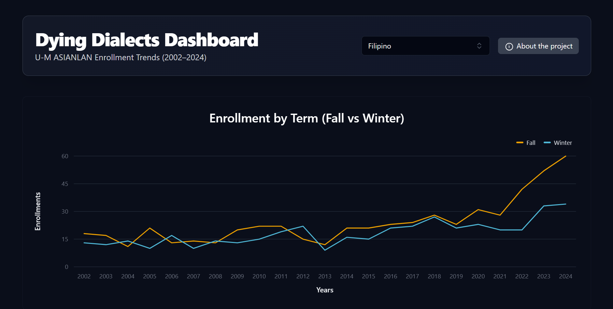

# Dying Dialects Dashboard

#### Spring 2025
---

  

  

**Dying Dialects Dashboard** is a grant-funded project developed in collaboration with the University of Michigan’s Language Resource Center. It visualizes enrollment and retention trends in underrepresented language programs, tracking how students move from beginner (100-level) to advanced (300–400-level) coursework.

I designed and built the dashboard using **React, Tailwind CSS, and Tremor**, transforming static spreadsheets into an accessible, interactive interface. Data was provided by the Language Resource Center's director, who also advised on feature goals to align with institutional priorities around language advocacy.

---

## Tools Used

**React**, **Vite**, **Tailwind CSS**, **Tremor**, **TypeScript**, **Pandas**, **JSON**

---

## Why It Matters

This dashboard surfaces trends often overlooked in traditional reporting and empowers faculty, students, and administrators to advocate for underrepresented language programs. Key features include:

- Interactive graphs broken down by term and course level
- Language selector for program-specific filtering
- Clear visuals of student progression and drop-off

The dashboard builds on my earlier **Chinese Enrollment Tracker**, scaling the concept into a grant-funded tool that will be presented to University of Michigan librarians in Fall 2025.

