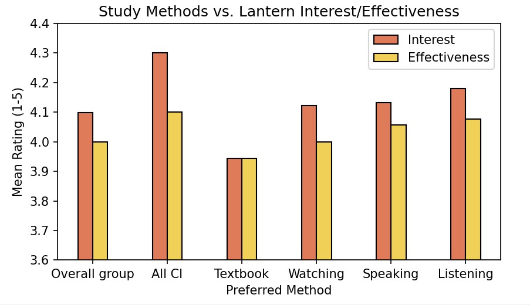
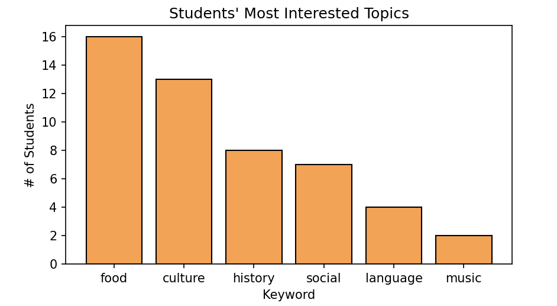

# Lantern

#### Fall 2024
---

  
  

**Lantern** is a podcast-based learning tool designed to support heritage Cantonese speakers. It offers native speaker audio, interactive transcripts, and contextual vocabulary features to reinforce understanding. The design is shaped by conversations with educators, insights from students, and the principles of *Comprehensible Input*.

---

## Tools Used

**Figma**, **Python**, **Pandas**, **Matplotlib**, **Google Forms**, **Canva**

---

## From Educators to Students

I began by meeting with three high school Mandarin teachers in Kansas City and Chicago to discuss how a supplemental learning tool could support their curriculum. All three emphasized **Dr. Stephen Krashen’s theory of Comprehensible Input**, which suggests that language acquisition happens best when learners are exposed to meaningful, understandable input.

From there, I presented to over 70 students and surveyed them about their language learning preferences, motivations, and how they engage with audio-based tools like podcasts.

---

  
  

Using **Python, Pandas, and Matplotlib**, I cleaned and visualized the data to identify key trends. One strong takeaway was a preference for comprehensible input through listening and contextual cues. These insights directly informed the next phase of the project.

---

## Designing the Interface

With a clear sense of student needs and teacher goals, I created a **Figma prototype** for Lantern. The mobile-first app includes personalized podcast recommendations, real-time transcripts, and tri-language vocabulary support.

The design emphasizes low cognitive load, smooth navigation, and language exposure that mimics natural listening environments.

---

## Feature Highlight

This slide from the pitch deck showcases Lantern’s core features, including transcript syncing, vocabulary saving, and flexible listening pace. Each one was chosen to support engagement without overwhelming learners.

  

