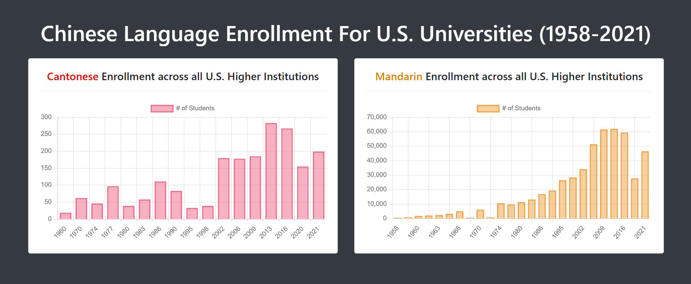

# Chinese Enrollment Tracker

#### Fall 2024
---

  

  

**Chinese Enrollment Tracker** is a static, Bootstrap-based site that visualizes historical Cantonese and Mandarin enrollment data in U.S. universities. Built using Chart.js and JSON-powered visualizations, this project transformed spreadsheet data from the Modern Language Association into an accessible, public-facing tool. 

The tracker revealed a sharp contrast between Mandarin’s growth and Cantonese’s decline, which were insights that were not highlighted in the MLA’s standard five-year reports.

---

## Tools Used

**Python**, **Pandas**, **SQLite**, **Chart.js**, **Bootstrap**, **HTML**, **CSS**, **JSON**

---

## Process

I began by downloading raw CSV files from the Modern Language Association’s Language Enrollment Database. Using **Pandas**, I cleaned the data and calculated enrollment trends and percentage changes over time. I also experimented with **SQLite** to structure the data into a local database and tested aggregate queries before ultimately converting the data into JSON for use with Chart.js.

While working on this project, I realized that **some tools were unnecessary**. For instance, querying a static dataset with SQL added complexity that Pandas alone could’ve handled. That realization shaped how I approached later dashboards with greater clarity and efficiency.

---

## Impact

Though early-stage and static, this dashboard helped demonstrate the **visual potential of language enrollment data** and earned support from U-M Language Resource Center faculty and academic partners. It directly contributed to securing a grant and institutional support from the University of Michigan Library for my follow-up project, Dying Dialects Dashboard.
