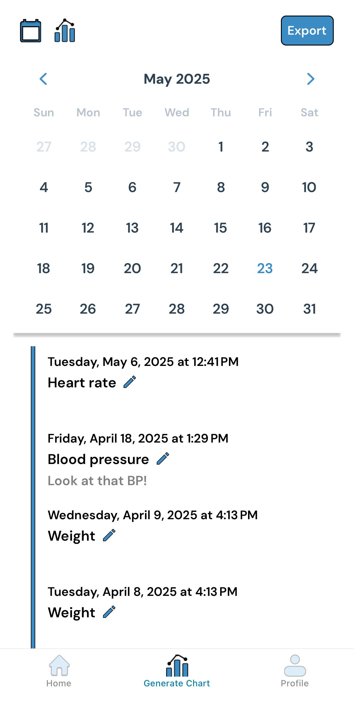

# MedStory

#### Winter 2025
---

  

    
<strong>MedStory</strong> is a mobile platform created to help patients with chronic illnesses document their daily symptoms and metrics. Built by a team of student developers and now an LLC, MedStory supports condition management for users navigating heart disease, long-term recovery, and more.

    
I contributed to the development of core features as part of a collaborative team of experienced developers. My work focused on the <strong>calendar logging interface</strong> and the <strong>data export function</strong> for generating PDFs from user input.

    
On the frontend, I integrated a calendar library using <strong>React Native and Expo</strong> to enable users to view and edit entries by date. On the backend, I developed <strong>Django-based Python functions</strong> that pulled user data and formatted it into stylized PDFs using HTML and CSS.

    
MedStory provided a space to work within a cross-functional team and contribute to a tool with direct impact on patient well-being. I learned how to bridge frontend design with backend data handling and communicate across stages of development. The experience sharpened my full-stack fluency and gave me insight into what it means to build meaningful products in healthcare.

  

  

---

## Tools Used

**React Native**, **Expo**, **Django**, **Python**, **TypeScript**, **HTML**, **CSS**

