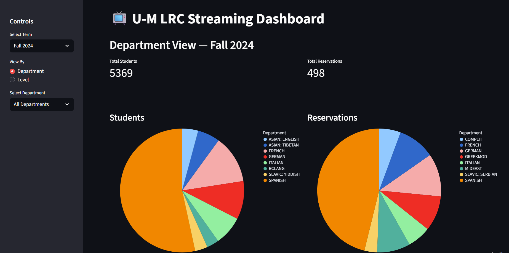
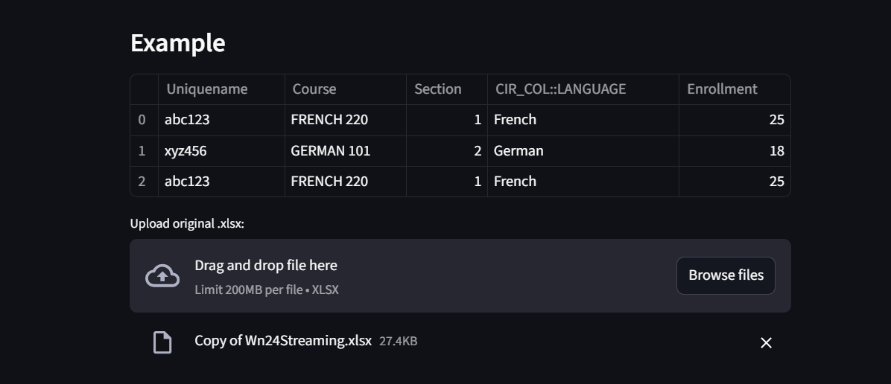

# LRC Streaming Snapshots

#### Summer 2025
---

  

**LRC Streaming Snapshots** is a commissioned tool I built for the University of Michigan’s Language Resource Center. It automates the cleanup and visualization of streaming media checkout data, revealing which departments use movies and shows to support language teaching.

Before this project, streaming data was never visualized, and staff spent **up to 12 hours every term** manually cleaning spreadsheets to get even basic summaries. Now, they can upload a file and get **clean, interactive charts in seconds**, helping them make faster, data-driven decisions about resource allocation and program support.

---

## What It Does

- Tracks streaming activity across terms  
- Filters by department and course level  
- Highlights top departments by student usage and reservations  
- Provides interactive, easy-to-read charts  
- Fetches updated data automatically from Google Drive  

---

## Data Uploader

I also built a web uploader so staff can drop in new term files, automatically clean the data, and update the dashboard. This tool ensures the dashboard stays up to date and eliminates repetitive manual work.

---

  

---

## Tools Used

**Python**, **Streamlit**, **Pandas**, **Altair**, **Google Drive API**, **Git & GitHub**

---

  
  

